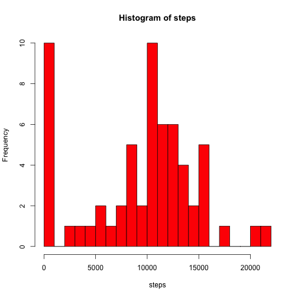
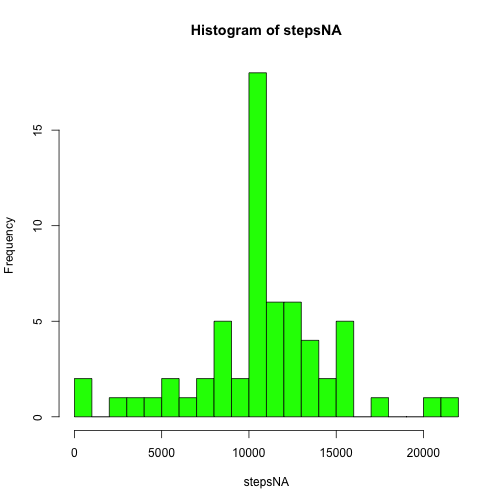
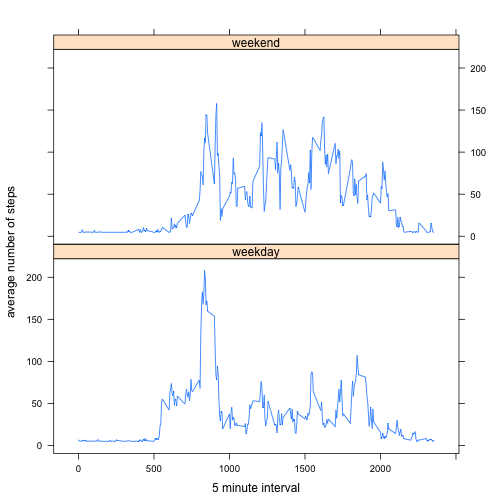

## Project 1 of Reproducable Research - Background
The data used in this assignment is personal movement data collected from activitiy monitoring devices such as Fitbit, Nike, Fuelband or Jawbone Up.  These are from individuals takeing measurements of themselves for the goal of self improvement.  A section of this data was selected by the Coursera Reproducable Research Staff and provided in a csv file for analysis.  

## Downloading the data

The dataset was stored in a comma separated value (csv) file which was stored in a folder 
called "data" in the working directory.  The following code reads that file into a dataframe.


```r
activity<-read.csv("./data/activity.csv")
```

## Section 1: Overview of the Data, removing NA

The first request was to create a histogram showing a breakdown of activity by date.  Twenty
sections were chosen as an appropriate number as that was sufficient to show the general trend
and the large number of instances of "zero steps".


```r
s<-split(activity,activity$date)
steps<-sapply(s,function(x) colSums(x[c("steps")],na.rm=T))
hist(steps, col="red",breaks = 20)
```

 

This graph used a data set for which all the missing values, the "NA", were removed for easier calculations. 


```r
stepMean<- mean(steps)
stepMedian<-median(steps)
```

The mean of the total set is 9354.2295 and the median is 1.0395 &times; 10<sup>4</sup>.

## What is the average daily activity pattern?

The following plot shows the average number of steps by interval.  People tend to have few
steps in the first 500 interval segments, and the highest number of steps occured in the second 500 5 minute interval segments. The low number are probably sleeping times.


```r
int<-split(activity,activity$interval)
fivemin<-sapply(int,function(x) colMeans(x[c("steps")],na.rm=T))
interval<-as.numeric(names(int))

plot(interval,fivemin,type="l",xlab="5 min interval",ylab="average steps")
```

 

Looking at the data set there is an obvious peak in steps taken. 

```r
which<- which.max(fivemin)  # max(fivemin) = 206.1698
```

The peak is at 104.


```r
Totalna<-sum(is.na(activity$steps))
```

## Inputting a mean for missing values

The data set has a lot of missing data.  There are 2304 instances of missing data. If that missing data were replaced with the mean value, how would this impact the statistics for activity levels?

To answer this question the data set was copied to a second data set called "activityNA".  In that data set all NA values were replaced by the mean of the intervals.  The data was then split exactly as had been done before and a new histogram (now green) can be made for comparison.


```r
activityNA<-activity
activityNA[is.na(activityNA$steps)=="TRUE",1]<-mean(fivemin)
sNA<-split(activityNA,activityNA$date)
stepsNA<-sapply(sNA,function(x) colSums(x[c("steps")]))
```

This is the histogram creation:

```r
hist(stepsNA, col="green", breaks=20)
```

 


```r
stepsNAmean=mean(stepsNA)
stepsNAmedian=median(stepsNA)
```

Comparing, with the NA value removed the mean of the total data set was 9354.2295 whereas 
the mean for the new data set is 1.0766 &times; 10<sup>4</sup>.  Interestingly the value for median for the old
set was 1.0395 &times; 10<sup>4</sup> where as with NA removed it is also 1.0766 &times; 10<sup>4</sup>.

## Are there differences in activity patterns between weekdays and weekends?

As would be expected weekday and weekend patterns differ.  To show this the data set (with NA removed) was modified to create a data set labeled with weekday and weekend days.  The first step to do this was to insert a column with either weekday or weekend depending on the date.


```r
activityNA$day<-weekdays(as.Date(activityNA$date))

for(i in 1:17568){
if(activityNA$day[i]=="Saturday"|activityNA$day[i]=="Sunday"){
  activityNA$week[i]<-"weekend"
}else{
  activityNA$week[i]<-"weekday"
}
}
```

The data frame was then made into two subset data frames, one with weekend data and one with weekday data.  Each was process so that the data was spilt by interval and the mean for each interval could be taken.  Lastly the two data frames were given identical column names and recombined into a new data frame called "activitysummary".


```r
weekends<-subset(activityNA,week=="weekend")
weekday<-subset(activityNA,week=="weekday")

weekendint<-split(weekends,weekends$interval)
fiveweekend<-sapply(weekendint,function(x) colMeans(x[c("steps")]))
intervalweekend<-as.numeric(names(weekendint))

weekdayint<-split(weekday,weekday$interval)
fiveweekday<-sapply(weekdayint,function(x) colMeans(x[c("steps")]))
intervalweekday<-as.numeric(names(weekdayint))

weekenddf=data.frame(intervalweekend,fiveweekend)
weekdaydf=data.frame(intervalweekday,fiveweekday)

weekenddf$week<-c("weekend")
weekdaydf$week<-c("weekday")
names(weekenddf)<-c("interval","avgSteps","week")
names(weekdaydf)<-c("interval","avgSteps","week")

activitysummary<-rbind(weekdaydf,weekenddf)
```

A lattice plot is used to show the steps mean by interval split by weekend and weekday.

```r
library(lattice)

xyplot(activitysummary$avgSteps~activitysummary$interval|activitysummary$week,type="l",layout=c(1,2),xlab="5 minute interval",ylab="average number of steps")
```

 

From these graphs it look like people sleep in longer on weekends and are generally more active thoughout the day.  On weekdays they get up earier, perhaps excercise before going to work and then are somewhat less active at work.  That suggests that the population in this sample are primarily knowledge workers doing standard 5 day, day shift, work with weekends off. 


